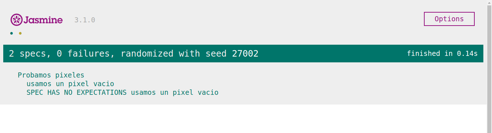

# Pruebas

Usando [Jasmine](https://jasmine.github.io/) y usando una [guía](http://javascriptmx.com/blog/pruebas-con-jasmine/), tenemos una forma simple y sencilla de realizar las pruebas.

---
## Ejecutar pruebas
Para ejecutarlas solo es necesario abrir el archivo ``index.html`` con un navegador, dejando la siguiente imagen.

---
## Descripción Rápida
Los archivos están distribuidos de la siguiente forma:

- La carpeta `jasmine` contiene todo lo necesario para ejecutar las pruebas.
- La carpeta `spec` contiene las pruebas en archivos `*.spec.js` y unos cuantos archivos de apoyo.